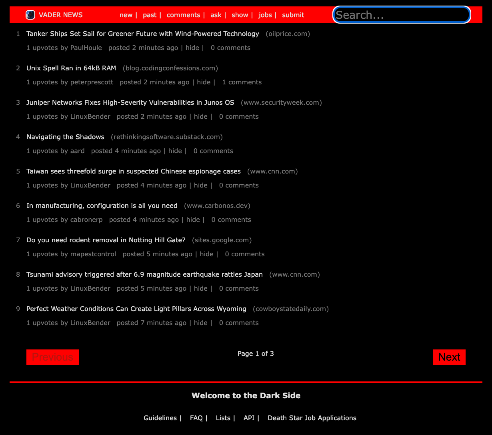

# Vader News - A Star Wars-Themed Hacker News Clone



## Project Overview
Vader News is a Star Wars-themed recreation of the Hacker News website, built during the WBS Coding School Bootcamp. This project fetches real-time news data from the Hacker News API and presents it with a unique Star Wars aesthetic.

## Features
- Real-time news feed using the Hacker News API
- Star Wars-themed user interface
- Article sorting and filtering capabilities
- Responsive design for various screen sizes
- Comments and discussion functionality

## Technologies Used
- React.js
- [Hacker News API](https://hn.algolia.com/api)
- CSS for Star Wars styling
- JavaScript ES6+
- Create React App

## Getting Started

### Prerequisites
- Node.js
- npm

### Installation
1. Clone the repository
   ```bash
   git clone https://github.com/yourusername/vader-news.git
   ```
2. Install dependencies
   ```bash
   npm install
   ```
3. Start the development server
   ```bash
   npm start
   ```
   The application will open at [http://localhost:3000](http://localhost:3000)

## Project Structure
```bash
vader-news/
├── src/
│ ├── components/
│ ├── styles/
│ └── utils/
├── public/
└── README.md
```

## Learning Outcomes
- Working with external APIs
- Building responsive React applications
- Implementing Search and Pagination functionalities
- Implementing theme-based designs
- Collaborative development in a team setting

## Contact
- GitHub: [@eikemx](https://github.com/eikemx)
- LinkedIn: [Eike Merx](https://www.linkedin.com/in/eike-merx-50b111216/)
- XING: [Eike Merx](https://www.xing.com/profile/Eike_Merx/web_profiles)

## Acknowledgments
- WBS Coding School
- Vlad-Constantin Preda
- Hacker News API team

---
*This project was created as part of the WBS Coding School Bootcamp curriculum.*